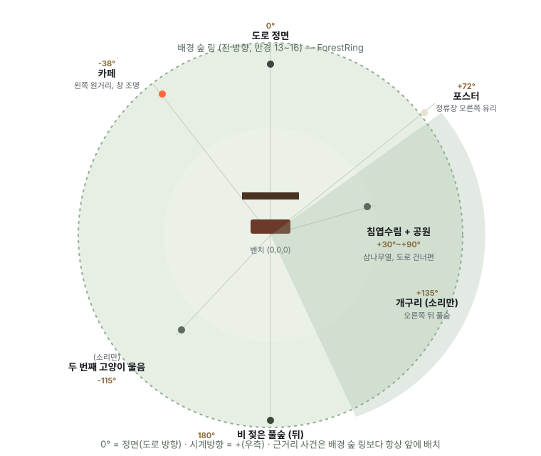

# 정류장 3D 배경 구성 기획

**작성:** 개발(세션) · 2026-08-25 · **상태: 초안 — 확인 요청**
**목적:** `/story-vr`의 3D 배경(그레이박스)을 코드로 계속 고쳐봐도 결과가 계속 이상하게 나왔다. 코드를 더 만지기 전에, **정류장_스크립트_v2(확정) + 정류장_스크립트_v1.1(확정)** 두 문서만 근거로 삼아 배경 구성을 다시 기획한다. 이 문서가 확정되기 전까지 코드는 손대지 않는다.

---

## 1. 기준 문서 — 이 두 개만 근거로 쓴다

1. **`정류장_스크립트_v1.1.md`** — 무대 구성(§공유되는 무대)과 **장르별 하늘·빛** 표 (원문 그대로, 아래 3절에 인용)
2. **`정류장_스크립트_v2.md` §1** — 공통 도입부의 사건별 방위·거리 서술 (원문 그대로, 아래 2절에 인용)

새로 지어낸 색상값·나무 종류·건물 형태는 없다 — 지어내야 하는 부분(정확한 헥스 코드, 폴리곤 개수 등 스크립트가 수치로 안 정한 것)은 4절에 "지어낸 부분"으로 명시한다.

## 2. 무대 — 공유되는 것과 갈리는 것 (v1.1)

> "공유되는 것은 무대의 전부 — 굽은 도로, 온실, 호수, 침엽수림, 정류장 — 이고, 갈리는 것은 하늘과 빛, 그리고 그 빛 아래 앉아 있는 사람입니다."
> "같은 배경이 다르게 보이게 만드는 것이 어렵습니다. 우리는 어려운 쪽을 선택했습니다."

**이게 핵심 설계 원칙이다 — 장르마다 나무를 다르게 심거나 건물을 바꾸는 게 아니라, 정확히 같은 지형에 하늘·빛만 바꾼다.** 지금까지 코드가 계속 이상해진 이유 중 하나는 이 원칙과 반대로, 나무 개수·배치·카페 크기를 장르 코드 없이 임의로 계속 조정했기 때문일 수 있다 — 지형은 한 번만 정하고 그 뒤로는 안 건드려야 한다.

## 3. 장르별 하늘과 빛 — v1.1 원문 표

| 장르 | 하늘이 하는 일 (원문) | 관객이 받는 감각 (원문) |
|---|---|---|
| 로맨스 | 구름이 갈라지며 낮은 해가 뚫고 나온다. 젖은 도로 전체가 금빛으로 빛난다 | 비 갠 뒤의 그 환함 — 무언가 좋은 일이 생길 것 같은 |
| 공포 | 구름이 더 두꺼워진다. 오후 세 시인데 밤처럼 어둡다 | 시간이 잘못된 것 같은 — 대낮의 어둠은 밤의 어둠보다 무섭다 |
| 블랙코미디 | 균일하게 밝은 흐림. 그림자가 사라진다 | 아무 일도 일어나지 않을 것 같은 평평함 — 그래서 작은 소동이 도드라진다 |

(판타지는 드롭 확정 — `구현_리스크와_지원_필요사항.md` §3)

**이 표가 시사하는 것 — 지금 구현이 놓친 부분:**
- **공포는 "밤"이 아니라 "오후 세 시인데 밤 같은" 것.** 파란 밤하늘이 아니라, 여전히 낮의 구도인데 구름만 두꺼워 어두운 것 — 지금처럼 무조건 짙은 청록/네이비로 가면 틀린 방향이다.
- **블랙코미디는 "그림자가 사라진다"가 명시적 지시.** 균일하게 밝은 흐림 = 강한 방향성 조명(directional light로 진한 그림자)을 쓰면 안 된다는 뜻 — 앰비언트 위주로, 그림자를 거의 없애야 한다.
- **로맨스만 "해가 뚫고 나온다"** — 셋 중 유일하게 방향성 있는 강한 광원(낮은 각도의 태양)이 있어야 하는 장르다.

## 4. 360도 배치도 (v2.md §1)

방위각은 **정면(도로 방향) = 0°, 시계방향 = 오른쪽(+)** 기준. 이 배치는 장르가 바뀌어도 그대로다 (2절 원칙).

| 방위각 | 요소 | 근거 |
|---|---|---|
| 0° | 도로 정면 (왕복 4차선, 왼쪽에서 나타나 오른쪽 침엽수림 뒤로 굽어 사라짐) | v2.md §1 원문 |
| -38°(지어낸 값) | 카페 (창 조명, "도로 건너편 왼쪽 약 50미터") | §1-2, 각도는 문서에 없어 서술로 추정 |
| +30°~+90°(지어낸 범위) | 침엽수림 + 호수공원 산책로, 고양이 등장 지점 | §1, §1-5 |
| +72°(지어낸 값) | 정류장 오른쪽 유리 — 찢어진 포스터 | §1-1, 유리가 오른쪽이라는 것만 원문, 각도는 추정 |
| +135°(지어낸 값) | 개구리 — "오른쪽 뒤 약 45도" (소리만, 3D 자산 불필요) | §1-4 원문 |
| 180° | 비 젖은 풀숲 (벤치 바로 뒤) | §1 원문 — **담장이라는 말은 원문에 없다, 풀숲이라고만 되어 있음** |
| -115°(지어낸 값) | 두 번째 고양이 울음 ("왼쪽 시야 밖", 소리만) | §1-5 원문 |
| 나머지 전 방위 | 침엽수림이 옅어지며 이어지는 배경 (스크립트엔 명시 없음, 하늘 구멍 방지용) | 지어낸 보강 |

## 5. 원화 대조 (`Bus/ArtWork_Final/1_디폴트/`)

**01_전체뷰** — 지붕·기둥·벤치 비례, 도로 폭 기준

**02_메인뷰** — 정면(0°) 시점. 나무가 지붕의 3~4배 높이, 극단적으로 가늚, 개체 수는 적고 사이 공간이 넓음

**03_사이드뷰** — 오른쪽(카페 방향 도로가 보이는 쪽) 시점

## 6. 확인 요청

1. **2절의 "지형은 한 번 정하면 장르 불문 고정" 원칙에 동의하시나요?** 동의하시면 다음 코드 작업은 "지형(나무 개수·위치·카페) 확정 → 그 뒤로 절대 안 건드림, 장르별로는 3절의 하늘/빛 값만 바꿈"으로 진행합니다.
2. 3절의 장르별 해석(공포=대낮의 두꺼운 구름/어두움, 블랙코미디=그림자 없는 균일한 밝음, 로맨스=낮은 태양의 강한 금빛)이 맞게 읽으신 건가요?
3. 4절 표에 "지어낸 값"이라고 표시한 방위각(-38°, +72°, +135°, -115°)은 스크립트에 숫자가 없어 서술만으로 추정한 것입니다 — 이 추정치로 진행해도 될까요, 아니면 다른 기준(예: 5절 원화의 실제 화각)으로 다시 잴까요?

---

## 7. 적용 상태 (2026-09-10 · `/film`)

위 확인 요청 세 가지는 `/film`(반응형 실시간 영화, `반응형_실시간_영화.md`)에서 다음처럼 적용했다. 답이 달라지면 코드의 한 곳만 고치면 된다.

1. **지형 고정 원칙 — 적용.** `components/ReactiveStage.jsx`는 `BlockoutStage.jsx`의 지형(나무·도로·정류장·카페·풀숲)을 그대로 가져다 쓰고, 장르별로는 하늘·태양·안개·도로 반사·가로등·네온·카페 불빛만 바꾼다.
2. **장르별 하늘 해석 — 3절 그대로 수치화.** `lib/directionMap.js`의 `ANCHORS`: 공포는 밤이 아니라 "대낮의 두꺼운 구름"(태양 고도 40° 유지, 세기만 0.22), 블랙코미디는 그림자 0에 앰비언트 1.15, 로맨스만 낮은 태양(14°)이 뚜렷하다. 값은 창작 결정이므로 아트가 이 표를 고치면 된다.
3. **방위각 추정치 — 그대로 사용.** `lib/directionMap.js`의 `AZIMUTH`(카페 −38°, 포스터 +72°, 개구리 +135°, 고양이 비명 −115°)와 `lib/filmTimeline.js`의 배우 경로가 이 값 위에 있다. 원화 화각으로 다시 재면 두 파일의 숫자만 바꾼다.
